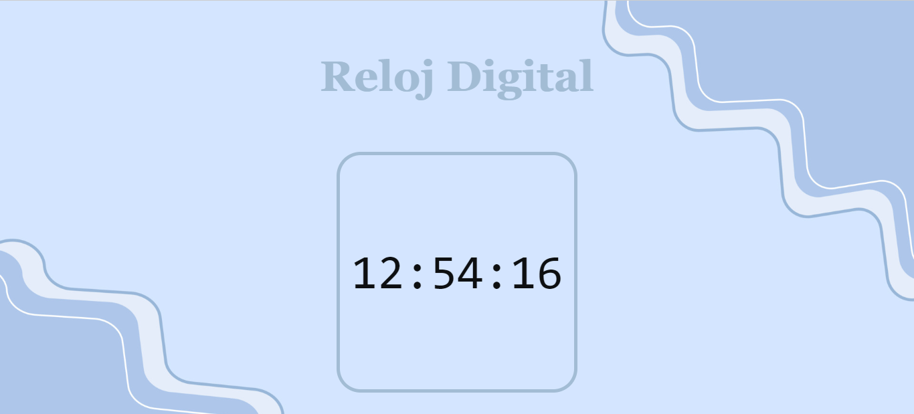

# Reloj Digital con JavaScript.

Proyecto realizado como práctica del bootcamp de Tecnolochicas Pro Proyectos.

## ¿Qué construí?

En este proyecto tuve como proposito construir un reloj digital con JavaScript.

Contine los siguientes elementos:

* Header.
* Main.

## ¿Qué tecnologías utilicé?

## Mi Objetivo:
Aprender a utilizar los lenguajes y las etiquetas principales de CSS y HTML.

## Mira aquí mi proyecto:
[Reloj Digital.](https://reloj-digital-delta.vercel.app/)

## 🔗 Más:

